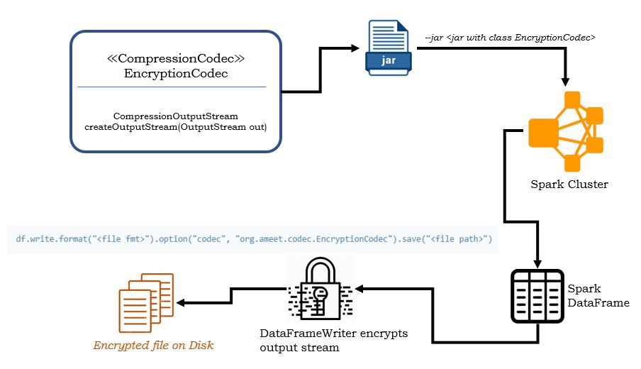

## Spark Encryption
### Objective:
Encrypt a spark `DataFrame` **before** writing to disk/file.

### Background:
In certain scenarios, it may not be allowed to persist the dataframe to disk even temporarily. This may be prohibited
 due to some regulations. 
 
### Approach:
Currently, no option exists on `DataFrameWriter` to encrypt the data frame being generated. However, there is an
 option to compress the dataframe before writing it to a file on disk. This is provided by the option, `codec`.
Spark allows using fully qualified class name of a class implementing, `org.apache.hadoop.io.compress.CompressionCodec`.

We can use a class which implements the above interface and provide the encryption functionality. The main method
 that this interface demands is as follows,
 ```java
CompressionOutputStream createOutputStream(OutputStream out)
```
`CompressionOutputStream` extends standard java `OutputStream`. 

Based on this, the high level approach is as follows,

+ Create a class which implements `CompressionCodec`
+ provide logic in method `createOutputStream`
+ Provide an encrypted stream as a class of `CompressionOutputStream`



The command to execute the encryption is summarized as follows,

```scala
df.write.format("<file fmt>").option("codec", "org.ameet.codec.EncryptionCodec").save("<file path>")
```

### Technical Details
The solution leverages encryption of *OutputStream* in java using `CipherOutputStream` mechanism. In this approach
, once the appropriate cipher initialization is done, a new OutputStream is generated by passing the incoming stream
 through encryption transformation.
 The project utlizes a *Strategy Pattern* enabling plugging of any encryption mechanism into the mix. It demonstrates
  2 approaches,
  + Symmetric encryption using AES
  + Asymmetric encryption using PGP
  
For PGP, the project makes use of `BouncyCastle` provider and a higher-level wrapper on it, `name.neuhalfen.projects.crypto.bouncycastle.openpgp`
This wrapper makes it convenient and clean to expose an output stream from the encryption process, specifically for PGP.
